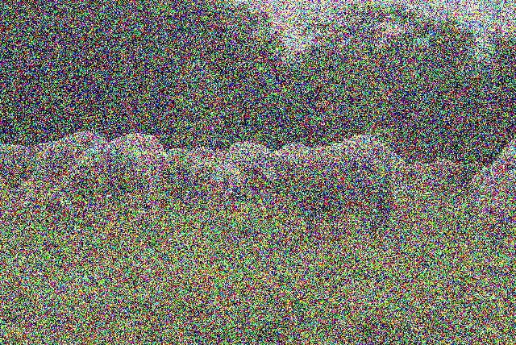

# Gemma v Molmo Sensor Degradation Ablation

This project was completed as a project for 24:788 Intro to Deep Learning at Carnegie Mellon University.

This project compares two 4B multimodal models on image captioning and measures how their performance changes when image quality degrades. Both models caption images from the COCO 2017 validation set under three conditions: clean images, motion blur, and Gaussian noise.

The evaluated models are:

- `google/gemma-4-E4B-it`
- `allenai/Molmo2-4B`

Generated captions are compared with COCO reference captions using CIDEr, SPICE, METEOR, and CLIPScore metrics. Motion blur is evaluated at kernel sizes 31, 61, and 91; Gaussian noise is evaluated at standard deviations 80, 160, and 240.

## Image Degradation Examples

### Motion Blur
The blur kernel increases from left to right.

<table>
  <tr>
    <th>Original</th>
    <th>Kernel 15</th>
    <th>Kernel 31</th>
    <th>Kernel 61</th>
  </tr>
  <tr>
    <td></td>
    <td></td>
    <td></td>
    <td></td>
  </tr>
</table>

### Gaussian Noise

The examples use the same noise levels as the evaluation.

<table>
  <tr>
    <th>Original</th>
    <th>Standard deviation 80</th>
    <th>Standard deviation 160</th>
    <th>Standard deviation 240</th>
  </tr>
  <tr>
    <td></td>
    <td></td>
    <td></td>
    <td></td>
  </tr>
</table>

## Setup

Create a virtual environment and install the project dependencies from the repository root:

```bash
python -m venv .venv
source .venv/bin/activate
python -m pip install --upgrade pip
python -m pip install -r requirements.txt
```

A Java runtime is also required to calculate SPICE scores.

Download and extract the COCO 2017 validation images and annotations:

```bash
mkdir -p data/coco-dataset
wget -P data/coco-dataset http://images.cocodataset.org/zips/val2017.zip
wget -P data/coco-dataset http://images.cocodataset.org/annotations/annotations_trainval2017.zip
unzip data/coco-dataset/val2017.zip -d data/coco-dataset
unzip data/coco-dataset/annotations_trainval2017.zip -d data/coco-dataset
```

## Run the Project

Select the model, dataset, output path, and prompt in [`src/model_configs.py`](src/model_configs.py), then run inference from the repository root:

```bash
python src/run_model.py
```

To create a motion-blurred dataset:

```bash
python src/create-ablation-data.py \
  --input_dir data/coco-dataset/val2017 \
  --output_dir data/ablation-datasets/blur31 \
  --type motion_blur \
  --kernel_size 31
```

To create a Gaussian-noise dataset:

```bash
python src/create-ablation-data.py \
  --input_dir data/coco-dataset/val2017 \
  --output_dir data/ablation-datasets/noise80 \
  --type gaussian_noise \
  --noise_std 80
```

To score a saved caption file:

```bash
python src/model-metrics.py \
  --json_path results/model-results/gemma-4-E4B-it_results_.json \
  --image_dir data/coco-dataset/val2017 \
  --model gemma-4b \
  --test COCO_val \
  --metrics cider spice meteor clip_score
```

The quickest way to inspect and reproduce the analysis is to open [`reproduce-results.ipynb`](reproduce-results.ipynb) and run all cells. It uses the saved metric CSV files and does not rerun model inference.

## Results

### Clean Images

On clean COCO images, Molmo 2 4B has the higher mean score on all four metrics.

| Model | CIDEr | SPICE | METEOR | CLIPScore |
| --- | ---: | ---: | ---: | ---: |
| Gemma 4B | 0.4242 | 0.1616 | 0.3731 | 0.3175 |
| Molmo 2 4B | 0.4512 | 0.2031 | 0.3820 | 0.3221 |


### Motion Blur

Both models decline as motion blur increases, but Molmo retains more caption quality at every tested blur level.

| Model | Clean CIDEr | Blur 31 | Blur 61 | Blur 91 |
| --- | ---: | ---: | ---: | ---: |
| Gemma 4B | 0.424 | 0.272 | 0.162 | 0.085 |
| Molmo 2 4B | 0.451 | 0.396 | 0.325 | 0.218 |

<table>
  <tr>
    <th>Gemma 4B under motion blur</th>
    <th>Molmo 2 4B under motion blur</th>
  </tr>
  <tr>
    <td></td>
    <td></td>
  </tr>
</table>

### Gaussian Noise

Gaussian noise produces a sharper decline than motion blur. Molmo again retains higher mean CIDEr scores across every tested level.

| Model | Clean CIDEr | Noise 80 | Noise 160 | Noise 240 |
| --- | ---: | ---: | ---: | ---: |
| Gemma 4B | 0.424 | 0.296 | 0.116 | 0.031 |
| Molmo 2 4B | 0.451 | 0.426 | 0.253 | 0.102 |

<table>
  <tr>
    <th>Gemma 4B under Gaussian noise</th>
    <th>Molmo 2 4B under Gaussian noise</th>
  </tr>
  <tr>
    <td></td>
    <td></td>
  </tr>
</table>

## Conclusion

Visual degradation consistently reduces caption quality. At the strongest tested setting, Gaussian noise reduces mean CIDEr from 0.424 to 0.031 for Gemma and from 0.451 to 0.102 for Molmo. Motion blur produces a smaller decline, ending at 0.085 for Gemma and 0.218 for Molmo. Molmo starts slightly ahead on clean images and remains more robust under both degradation types.
